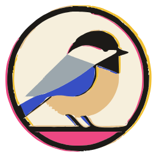

<div align="center">



# Chickadee

**Your own code is the textbook.**

A desktop study app for people who shipped an app with AI but cannot read what they shipped.

</div>

## What it is

You vibe-coded an app. It works. You cannot explain a single line of it.

Chickadee reads **your** repository and turns it into study material — not someone else's
tutorial examples. It parses your files with tree-sitter, finds where each language concept
actually appears in your code, and builds cards from those exact lines. Every repository
produces a different curriculum, because every repository is a different set of things
you have not yet understood.

The bet is that reading is recognition, not knowledge. Explanations are something Claude
already gives you. What is missing is **forced active output** — so the app makes you
produce, not read.

## Three tracks, none of which run your code

| Track | Problem | Graded by |
|---|---|---|
| **T0 · Syntax** | Meaning, fill-in-the-blank, point-at-it — one line of your code plus context | Multiple choice / pointing |
| **T1 · Clone coding** | Three fading stages: copy it → skeleton only → blank page | Line-level equivalence against the original |
| **T2 · Structure** | Responsibility placement, blast radius, flow tracing, dependency direction | Your real commits as the answer key |

Nothing is executed. That is what makes every language reachable — grading needs a parser
and a diff, not a runtime.

## How it works

```
your repo (read-only)                     grammar dictionary (YAML + tree-sitter queries)
      │                                                  │
      ▼                                                  ▼
┌─ thin Rust ─────────────────────────────────────────────────────────┐
│  git2 · tree-sitter · rusqlite — writes only FACTS to SQLite:       │
│  file · capture · commit · commit_file.  ≤ 2300 lines, CI-enforced. │
└──────────────────────────────┬──────────────────────────────────────┘
                               ▼
┌─ thick TypeScript ──────────────────────────────────────────────────┐
│  concept sites · cards · FSRS scheduling · grading · the entire UI  │
└─────────────────────────────────────────────────────────────────────┘
```

Rust knows nothing about the domain. It has no word for "card" or "concept" — a CI script
greps for those and fails the build. The reasoning: the people maintaining this are vibe
coders, and Rust is the one language vibe coding does not carry. So every bug is pushed
into TypeScript, where it can actually be fixed.

Mastery accrues **per concept**, not per file — so it survives you rewriting the repo, and
your deck never explodes. Intervals come from FSRS.

## Privacy

**Your code never leaves your machine.** No telemetry, no crash upload, no sync. The app
makes zero network calls; the CSP is `default-src 'self'`. Data lives in one local SQLite
file.

The single exception is opt-in and explicit: if you enable the LLM step of the "I don't
know" ladder, the app sends **one line plus four lines of context on each side** — never a
directory path, repository name, commit message, or author. Without an API key that step
just builds the prompt for you to copy.

## Status

**Pre-alpha.** The skeleton is up: workspace, Tauri window, SQLite schema and migrations,
design tokens, and the CI gates. Ingest, cards, and the study session are not built yet.
There is nothing to install.

## Stack

Tauri 2 · Rust (git2, tree-sitter, rusqlite) · React 19 + Vite 6 · Monaco · SQLite · FSRS.

Design docs live in `docs/` (Korean). The UI ships in Korean.

## License

MIT. Bundled fonts (IBM Plex Sans KR, IBM Plex Mono, Black Han Sans) are SIL OFL 1.1 —
see `apps/desktop/src/assets/fonts/`.
